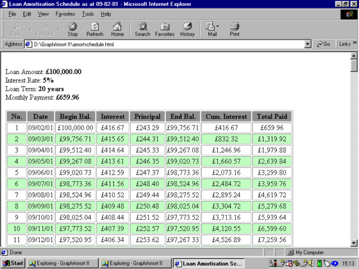



## MSFlexgrid to HTML

### Description

This is an update of GraphAmort, a previous offering of mine. This time, you can export the contents of the loan amortisation schedule to a HTML file, for universal display, e-mailing etc. You can now also copy the graph to the clipboard for pasting into a graphics package (I should've added this the first time!).
 
### More Info
 

             |
---                |---
**Submitted On**   |2001-02-09 15:03:46
**By**             |[Eoin Armstrong](https://github.com/Planet-Source-Code/PSCIndex/blob/master/ByAuthor/eoin-armstrong.md)
**Level**          |Intermediate
**User Rating**    |5.0 (25 globes from 5 users)
**Compatibility**  |VB 6\.0
**Category**       |[Math/ Dates](https://github.com/Planet-Source-Code/PSCIndex/blob/master/ByCategory/math-dates__1-37.md)
**World**          |[Visual Basic](https://github.com/Planet-Source-Code/PSCIndex/blob/master/ByWorld/visual-basic.md)
**Archive File**   |[CODE\_UPLOAD14720292001\.zip](https://github.com/Planet-Source-Code/eoin-armstrong-msflexgrid-to-html__1-15142/archive/master.zip)

